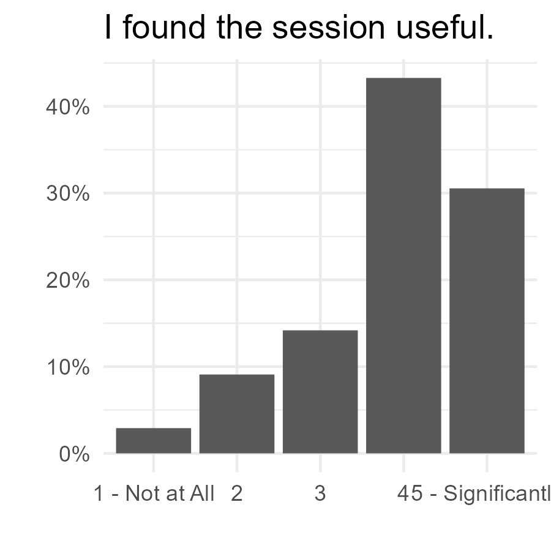

class: center, middle, hide-logo

```{css echo=FALSE}

.remark-slide-content {
  font-size: 32px;
  font-family: 'optima', sans-serif;
}

h1 {
  font-family: 'optima', sans-serif;
  font-size: 30px;
  background-color: #8F9CB9;
  color: white;
  font-weight: bold;
  text-align:center;
  padding: 22px; /* padding will fill in color to edges*/
}

h2 {
  font-family: 'optima', sans-serif;
  background-color: #8F9CB9;
  color: white;
  font-size: 18px;
  font-weight: bold;
  padding: 10px; /* padding will fill in color to edges*/
}

h3 {
  font-family: 'optima', sans-serif;
  background-color: #8F9CB9;
  color: white;
  font-size: 14px;
  font-weight: bold;
  padding: 0px; /* padding will fill in color to edges*/
}

h4 {
  font-family: 'optima', sans-serif;
  background-color: #bcc5d8;
  color: black;
  font-size: 13px;
  font-weight: bold;
  padding: 0px; /* padding will fill in color to edges*/
}

.footnote {
  text-align: right;
  position: absolute;
  bottom: 5px;
  right: 35px;
  padding-right: 4em;
  font-size: 75%;
}

.center2 {
  margin: 0;
  position: absolute;
  top: 57%;
  left: 50%;
  -ms-transform: translate(-50%, -50%);
  transform: translate(-50%, -50%);
}

```

```{r setup, include=FALSE}
knitr::opts_chunk$set(echo = FALSE)
suppressPackageStartupMessages(library(tidyverse))
suppressPackageStartupMessages(library(scales))
suppressPackageStartupMessages(library(kableExtra))
suppressPackageStartupMessages(library(flextable))
suppressPackageStartupMessages(library(knitr))
# https://bookdown.org/yihui/rmarkdown/ioslides-presentation.html
# https://www.r-bloggers.com/getting-started-with-r-markdown-guide-and-cheatsheet/
# https://www.youtube.com/watch?v=dbljY7jxrSA
```

## Introduction to RMarkdown
### Greg Rousell


---
class: left

## Introduction to R Markdown
### Agenda

- Introductions & Objectives
- Why RMarkdown?
- Basics
- PDF
- HTML
- Word
- Online Dashboards

---
## Introductions & Objectives

- Name and organization
- Experience with R, RStudio
- What do you hope to get out of today

---
## GitHub

- All the materials are hosted on my GitHub page: 

https://github.com/grousell/Intro-RMarkdown

---

## Why RMarkdown?

- One language is translated to different languages (HTML, LaTex, Word)
- Provides environment for data anaysis and notes
- Creates high quality reports for distribution 
- Easily reproduce analyses and reports for different groups

---
## Getting Started

.center2[
```{r echo = FALSE, out.width="90%"}

```
]

---
## Getting Started

.center2[
```{r echo = FALSE, out.width="90%"}

```
]


---
## Basics

.pull-left[

`*Italics*`  
`**Bold**`  
`***Bold and Italics***`
`'Inline Code'`  
`# First Level Heading`  
`# Second Level Heading`  
`` 
]

.pull-right[
*Italics*  
**Bold**  
***Bold and Italics***  
`Inline Code`  
### First Level Heading  
#### Second Level Heading  

]

---

## Lists

* Unordered lists are started with `*` or `-`  
* Ordered lists begin with a number  
* Sublists are created by indenting 4 spaces, or tab  

.pull-left[

]
.pull-right[

]

---
## Practice

* Open RStudio and a new RMarkdown file to create a PDF. 
* Click "Run" and knit the file
* Change some text and knit again
* Try different formats (HTML, Word, PowerPoint)

---
## Adding R Code

.pull-left[

]

.pull-right[

]

---

## Adding R Code

.center2[
```{r echo=FALSE, out.width="120%"}


```
]


---
## Charts
```{r echo=FALSE, include=FALSE}

df <- read_csv("data/sample_data.csv")

levels <- c ("1 - Not at All", 
             "2",
             "3", 
             "4", 
             "5 - Significantly")

df <- df |> 
  mutate_at(vars (starts_with("session")),
            ~(parse_factor(., levels = levels)
                 )
            )
```

```{r echo = TRUE}

chart <- df |> 
  count (session_useful) |> 
  mutate (perc = n / sum (n)) |> 
  ggplot (aes (session_useful, perc)) +
  geom_col() +
  scale_y_continuous(labels = scales::percent_format(accuracy = 1),
                     limits = c(0,0.5)) +
  geom_text (aes (label = scales::percent(perc)),
             vjust = -1) +
  labs (title = "I found the session useful", 
        x = "",
        y = "Percent")
  
```

---
## Charts

```{r fig.align='center'}

chart
```

---
## Charts
.pull-left[

]
.pull-right[
```{r fig.width=3}

chart 

```
]

---
class: left
## Charts


```{r fig.width=8, fig.height=2}

chart 

```

---
## Practice

* In practice rmd file, add a new chuck of R code and read in some data
  * df <- read_csv ("https://t.ly/7hzC")
* Create quick plot and insert into document

---
## Tables

```{r echo=TRUE}
table <- df |> 
  count (session_useful) |> 
  rename (`I found the session useful` = session_useful) |> 
  mutate (Percent = scales::percent (n / sum (n)) )

table
```

---
## Tables

```{r echo=TRUE}
table |> 
  kable()
```

---
## Tables: `kableExtra`

http://haozhu233.github.io/kableExtra/awesome_table_in_html.html

```{r echo=TRUE}
table |> 
  kable() |> 
  kable_styling(position = "center", font_size = 25)
```

---
## Tables: `kableExtra`

```{r echo=TRUE, results='asis'}
table |>
  kable(align = c ("lcc")) |> 
  kable_styling(font_size = 25) |> 
  column_spec(2:3, width = "8em")
```

---
## Tables: `kableExtra`

```{r echo=TRUE, results='hide'}
table |>
  mutate (Percent = cell_spec (Percent, 
                               background = "#FA19C3"),
          n = ifelse (n > 40, 
                      cell_spec (n, color = "green"),
                      cell_spec (n, color = "red"))) |> 
  kable(escape = FALSE, 
        align = c ("lcc")) |> 
  kable_styling(font_size = 25) |> 
  column_spec(2:3, width = "8em")
```


---
## Tables: `kableExtra`

```{r echo=FALSE, results='asis'}
table |>
  mutate (Percent = cell_spec (Percent, 
                               background = "#FA19C3"),
          n = ifelse (n > 40, 
                      cell_spec (n, color = "green"),
                      cell_spec (n, color = "red"))) |> 
  kable(escape = FALSE, 
        align = c ("lcc")) |> 
  kable_styling(font_size = 25) |> 
  column_spec(2:3, width = "8em")


```

---
## Tables

Other packages include:
- `flextable`
- `gt`
- `formattable`


---
## Practice

* In practice rmd file, add a new chuck of R code and insert table into document
* Add some custome formatting
  * https://bit.ly/kable_extra
  * https://bit.ly/flextable

---

## Split Columns 


---

## Split Columns 


---
## Split Columns 

```{r message=FALSE}
plot <- df |> 
  count (session_useful) |> 
  mutate (perc = n / sum(n)) |> 
  ggplot (aes (x = session_useful, y = perc)) + 
  geom_col() + 
  scale_y_continuous(labels = scales::percent_format(accuracy = 1)) + 
  labs (x = "", y = "", title = "I found the session useful.") + 
  theme_minimal()

ggsave (plot, 
        filename = "images/plot.png", 
        width = 3, 
        height = 3)
```

.pull-left[
The figure on the right shows Horsepower vs Miles per Gallon. 
]
.pull-right[

]

---
## Multiple Reports - One File

```{r eval=FALSE, echo=TRUE}

for (sch in unique(df$school)) {  
  rmarkdown::render("Advanced_PDF_Example.Rmd",  
                    output_file =  paste(sch, "_report.pdf", sep=''),   
                    output_dir = './reports/')  
}

```

---
## Practice

* Create custom report using multi-columns
* Try loop to create multiple reports

---
## Questions?


